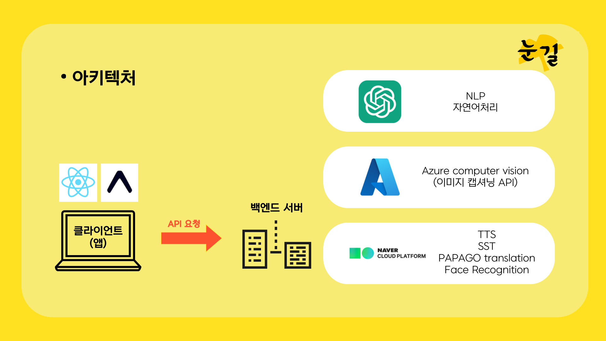

# 눈길
### 여러분의 새로운 눈이 될게요   

## 눈길은 어떤 서비스인가요?
눈길은 저시력자, 시각장애인 분들께 인공지능 이미지 인식 기술을 통해 세상을 보여 드리는 앱 서비스입니다.

## 어떻게 사용하죠?   
화면을 탭하고, 눈길에게 궁금한 것을 물어보세요.   
눈길은 사용자들을 위해 모든 UI를 음성과 햅틱으로만 제공합니다.
자연어처리 기술을 통해 눈길은 여러분의 요구사항을 파악하고, 알맞은 기능을 호출합니다.
현재(버전 0.1.0) 사용 가능한 기능은 다음과 같습니다.
- 장면 인식   
눈길이 눈앞의 장면을 한 문장으로 묘사합니다.
- 글읽기   
눈길이 글을 읽어주고, 설명합니다.
- 닮은꼴 찾기   
눈길이 앞 사람의 닮은꼴 유명인을 찾습니다.
- 표정읽기   
눈길이 앞 사람의 표정을 분석합니다.

## 어떻게 작동하죠?

눈길은 다양한 클라우드 서비스를 이용하여 이미지를 분석하고, 분석 결과를 가공하여 사용자에게 제공합니다. 다음과 같은 기술들이 적용되어 있습니다.
- GPT3.5 Turbo를 사용하여, 사용자의 질문에 자연스러운 대화체로 대답을 제공합니다.
- MS Azure의 computer vision API를 적용하여, 보다 정확한 이미지 캡셔닝(이미지 속 상황을 묘사해주는 기술)을 제공합니다.
- Naver Cloud Platform의 다양한 API들이 적용되어 있습니다.
  - Clova Voice(TTS)는 눈길의 목소리를 자연스럽게 제공합니다.
  - Clova Speech Recognition(STT)는 사용자의 음성을 인식하여 텍스트로 변환합니다.
  - Papago Translation은 영어로 이루어진 API 응답을 자연스러운 우리말로 변환합니다.
  - Face Recognition은 얼굴 이미지로부터 닮은꼴의 유명인을 찾고, 감정을 분석합니다.

